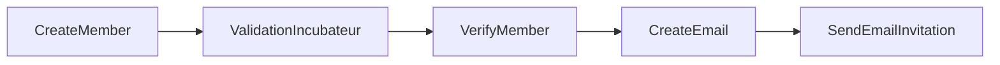
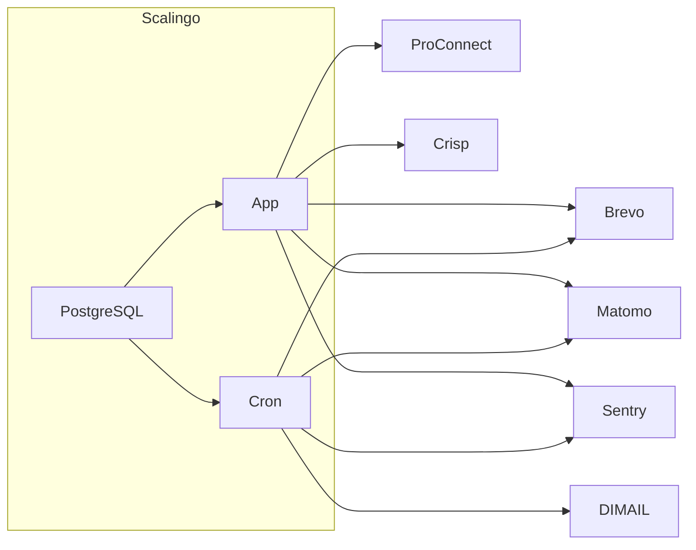

# Espace Membre

L'espace membre de l’incubateur

## Fonctionnalités

- gestion des membres et missions
- gestion des produits, incubateurs, équipes, sponsors
- gestion du compte beta:
  - adresse email & préférences de communication
  - accès aux outils (sentry, matomo)
- exploration de la communauté
- afficher les formations et évènements
- connexion via ProConnect ou magic-link
- tâches de maintenance (cf [CRON.md](./CRON.md)) : emails,
  mattermost, brevo, github

## Dev de l'app Espace Membre

Un fichier [`Makefile`](./Makefile) ainsi que la partie `scripts` du
fichier [`package.json`](./package.json) recensent les commandes
utiles du projet.

### Variables d'environnement

copier [`.env.development`](./.env.development) en `.env`

### Lancer en mode développement

Un environnement Docker Compose permet de lancer l'application et ses
dépendances ensemble :

```sh
docker compose up
```

Si vous voulez lancer l'application en local, vous devez lui fournir
une base de données accessible via une variable d'environnement `DATABASE_URL`.

### Données initiales

Une fois que votre application tourne, vous pouvez utiliser la
commande suivante pour obtenir des données initiales ; utilisez
d'abord `make sh` pour accéder à votre conteneur Docker.

```sh
npm run seed
npm run dev-import-from-www # Ajoute les données du site beta.gouv.fr (utilisateur, produits, incubateurs, ...)
```

L'application est disponible sur http://localhost:8100 et vous pouvez
vous logger – une fois que la base de données est peuplée avec le
seeding au dessus – avec `valid.member@betagouv.ovh` puis en
récupérant l'email de connexion sur le maildev disponible sur
http://localhost:1080.

### Lancer les tests

```sh
npm run test
```

### Debug avec le serveur SMTP Maildev

[Maildev](http://maildev.github.io/maildev/) est un serveur SMTP avec une interface web conçu pour le développement et les tests.

Le docker-compose intègre une instance de maildev pour le développement.

Tous les emails envoyés par le code de l'espace membre seront visibles depuis l'interface web de Maildev (`http://localhost:1080/`).

## Cron Jobs

Voir le détail dans [CRON.md](./CRON.md)

## Workflows

### Member creation


```mermaid
graph LR

CreateMember-->ValidationIncubateur
ValidationIncubateur-->VerifyMember
VerifyMember-->CreateEmail
CreateEmail-->SendEmailInvitation
```

### Member Offboarding

- J-30 : Message J-30 (N8N)
- J-15 : Message J-15 (N8N)
- J-1 : Message J-1 (N8N)
- J+1 : Message J+1 (N8N)
- J+1 : GitHub account is removed from organisation (N8N)
- J+5 : email is set as SUSPENDED [⚠ BROKEN]
- J+30 : Message J+30 (N8N)
- J+30 : mattermost account is removed from community and added to alumni (N8N)
- J+30 : matomo account is disabled (N8N)
- J+30 : sentry account is disabled (N8N)

see [CRON.md](./CRON.md)

### Matrice des droits

| Rôle      | Inviter un membre | Modifier mon compte | Modifier un membre | Editer une fiche produit |
| --------- | :---------------: | :-----------------: | :----------------: | :----------------------: |
| Admin     |        ✅         |         ✅          |         ✅         |            ✅            |
| Teams     |        ✅         |         ✅          |         ✅         |            ✅            |
| Member    |        ✅         |         ✅          |         ❌         |            ✅            |
| Anonymous |        ❌         |         ❌          |         ❌         |            ❌            |

### Diagramme de flux


```mermaid
graph LR

subgraph Scalingo
PostgreSQL-->App
PostgreSQL-->Cron
end

App-->ProConnect
App-->Crisp
App-->Brevo
App-->Matomo
App-->Sentry


Cron--->Brevo
Cron--->DIMAIL
Cron--->Matomo
Cron--->Sentry
```
