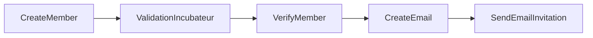
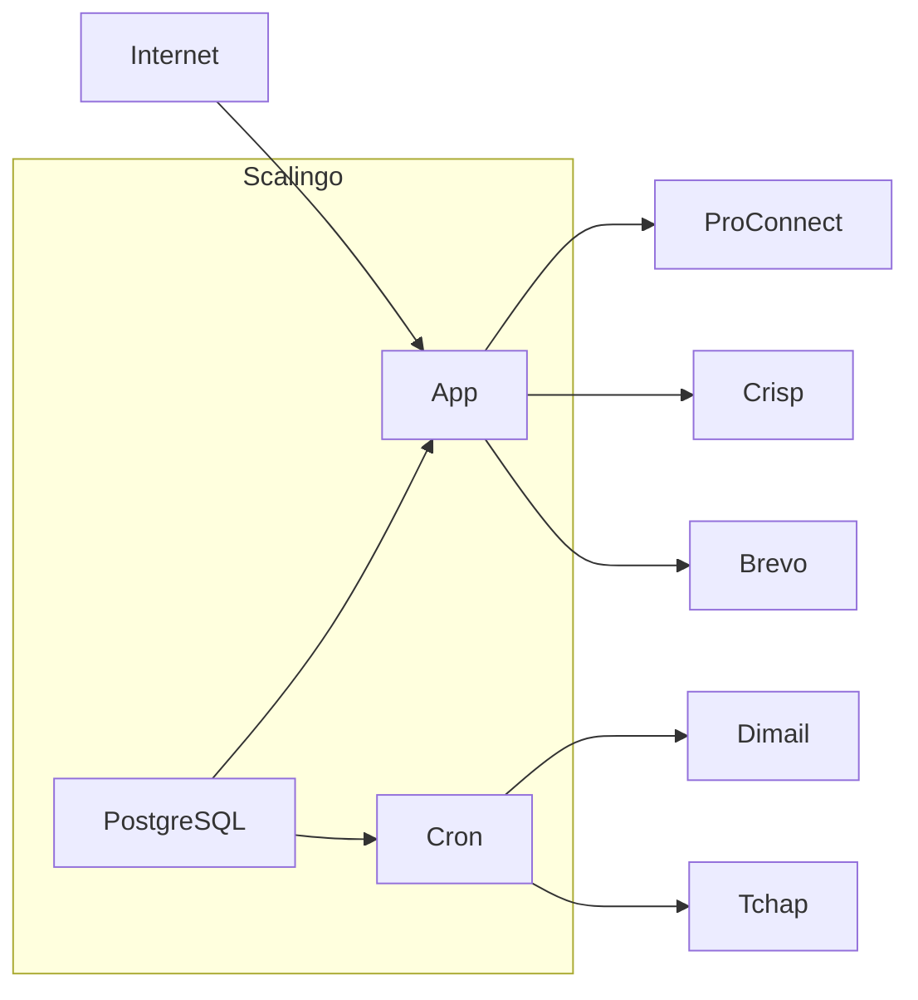

# Espace Membre

L'espace membre de l’incubateur

## Fonctionnalités

- gestion des membres et missions
- gestion des produits, incubateurs, équipes, sponsors
- gestion du compte beta:
  - adresse email & préférences de communication
  - accès aux outils (sentry, matomo)
- exploration de la communauté
- afficher les formations et évènements
- connexion via ProConnect ou magic-link
- tâches de maintenance (cf [Cron Jobs](#cron-jobs)) : emails,
  mattermost, brevo, github

## Dev de l'app Espace Membre

Un fichier [`Makefile`](./Makefile) ainsi que la partie `scripts` du
fichier [`package.json`](./package.json) recensent les commandes
utiles du projet.

### Variables d'environnement

copier [`.env.development`](./.env.development) en `.env`

### Lancer en mode développement

Un environnement Docker Compose permet de lancer l'application et ses
dépendances ensemble :

```sh
docker compose up
```

Si vous voulez lancer l'application en local, vous devez lui fournir
une base de données accessible via une variable d'environnement `DATABASE_URL`.

### Données initiales

Une fois que votre application tourne, vous pouvez utiliser la
commande suivante pour obtenir des données initiales ; utilisez
d'abord `make sh` pour accéder à votre conteneur Docker.

```sh
npm run seed
npm run dev-import-from-www # Ajoute les données du site beta.gouv.fr (utilisateur, produits, incubateurs, ...)
```

L'application est disponible sur http://localhost:8100 et vous pouvez
vous logger – une fois que la base de données est peuplée avec le
seeding au dessus – avec `valid.member@betagouv.ovh` puis en
récupérant l'email de connexion sur le maildev disponible sur
http://localhost:1080.

### Lancer les tests

```sh
npm run test
```

### Debug avec le serveur SMTP Maildev

[Maildev](http://maildev.github.io/maildev/) est un serveur SMTP avec une interface web conçu pour le développement et les tests.

Le docker-compose intègre une instance de maildev pour le développement.

Tous les emails envoyés par le code de l'espace membre seront visibles depuis l'interface web de Maildev (`http://localhost:1080/`).

## Cron Jobs

> ⚠️ Le Scalingo Scheduler exécute les commandes en UTC (pas de gestion de fuseau
> horaire), contrairement à l'ancienne planification pg-boss qui forçait
> `Europe/Paris`. Les heures ci-dessous sont donc correctes en hiver
> (UTC = heure de Paris − 1h) et décalées d'une heure en été (heure d'été, UTC+2).
> Ces jobs ne s'exécutent que sur l'app dédiée `espace-membre-cron` (garde
> `[[ "$APP" = "espace-membre-cron" ]]`), planifiée via [`cron.json`](./cron.json)
> (Scalingo Scheduler).

| fréquence (UTC)    | commande                                    | description                                                              |
| ------------------ | ------------------------------------------- | ------------------------------------------------------------------------ |
| `0 18 * * MON-FRI` | `npm run export-to-www`                     | Exporte les données vers le site beta.gouv.fr                            |
| `0 3 * * *`        | `npm run job:sync-matrix-accounts`          | Indexe les comptes Matrix (Tchap) des utilisateurs                       |
| `0 8 * * *`        | `npm run job:clean-teams-members`           | Supprime les membres expirés des équipes incubateurs                     |
| `0 8-18 * * *`     | `npm run job:sync-dinum-emails`             | Met à jour la table `dinum_emails` depuis l'API Dimail                   |
| `0 * * * *`        | `npm run job:recreate-email-if-user-active` | Recrée/réactive l'email des comptes actifs repassés en `EMAIL_SUSPENDED` |

Un seul job reste géré par [pg-boss](https://github.com/timgit/pg-boss), déclenché
à la demande (et non planifié) : `create-dimail-mailbox`, qui crée une boite mail
Dimail pour un utilisateur.

Les autres tâches de maintenance (relances avant/après mission, retrait des comptes GitHub/Matomo/Sentry...) sont gérées par des workflows n8n.

## Cycle de vie des utilisateurs

Un utilisateur est représenté par une ou plusieurs **missions** (contrats), chacune
avec une date de début et de fin. L'utilisateur est considéré **actif** tant qu'il a
au moins une mission dont la date de fin n'est pas dépassée
(cf `checkUserIsExpired` dans [`src/lib/utils.ts`](./src/lib/utils.ts)) ; il devient
**expiré** dès que sa dernière mission connue est terminée.

### Arrivée (onboarding)


```mermaid
graph LR

CreateMember-->ValidationIncubateur
ValidationIncubateur-->VerifyMember
VerifyMember-->CreateEmail
CreateEmail-->SendEmailInvitation
```

1. Une fiche membre est créée (par la personne elle-même ou un membre de son
   équipe/produit), avec une première mission.
2. L'incubateur valide la fiche (`ValidationIncubateur`).
3. Le membre vérifie/complète ses informations (`VerifyMember`).
4. Une adresse `@beta.gouv.fr` est créée via Dimail (`CreateEmail`, statut
   `EMAIL_CREATION_WAITING` puis `EMAIL_ACTIVE`).
5. Une invitation est envoyée par email (`SendEmailInvitation`).

### Départ (offboarding)

Déclenché automatiquement à l'approche puis au passage de la date de fin de mission
(workflows n8n) :

- **J-30 / J-15 / J-1** : messages de rappel envoyés au membre (N8N)
- **J+1** : le compte GitHub est retiré de l'organisation (N8N)
- **J+5** : l'email primaire passe en `EMAIL_SUSPENDED` (N8N)
- **J+30** : message final (N8N)
- **J+30** : le compte Tchap est retiré de la communauté (N8N)
- **J+30** : le compte Matomo est désactivé (N8N)
- **J+30** : le compte Sentry est désactivé (N8N)

### Retour d'un utilisateur (self-healing)

Si un utilisateur redevient actif (nouvelle mission) après être passé en
`EMAIL_SUSPENDED`, le job horaire `job:recreate-email-if-user-active`
(voir [Cron Jobs](#cron-jobs)) le détecte et :

- réactive sa boite Dimail existante (repasse `imap_active` à `yes` et le statut à
  `EMAIL_ACTIVE`) si elle existe déjà,
- sinon en crée une nouvelle via `createDimailMailboxForUser`.

### Statuts de l'email primaire (`EmailStatusCode`)

Définis dans [`src/models/member.ts`](./src/models/member.ts) :

| Statut                                              | Signification                        |
| --------------------------------------------------- | ------------------------------------ |
| `EMAIL_UNSET`                                       | Aucun email primaire défini          |
| `EMAIL_CREATION_WAITING` / `EMAIL_CREATION_PENDING` | Création de la boite en cours        |
| `EMAIL_ACTIVE`                                      | Boite active                         |
| `EMAIL_ACTIVE_AND_PASSWORD_DEFINITION_PENDING`      | Boite active, mot de passe à définir |
| `EMAIL_SUSPENDED`                                   | Boite suspendue (mission terminée)   |
| `EMAIL_DELETED`                                     | Boite supprimée _(déprécié)_         |

## Droits

Les permissions sont vérifiées côté serveur (routes sous
[`src/app/api`](./src/app/api)), pas seulement côté affichage :

- **Admin** : liste de logins définie par la variable d'environnement
  `ESPACE_MEMBRE_ADMIN` (cf [`src/server/config/admin.config.ts`](./src/server/config/admin.config.ts)).
  `session.user.isAdmin` est calculé à la connexion et donne tous les droits.
- **Membre d'équipe/produit (Teams)** : peut modifier la fiche d'un autre membre
  s'il appartient à une équipe incubateur en commun avec ce membre (via ses
  produits ou ses équipes), ou s'il partage un produit avec lui et a un statut
  légal `contractuel` ou `fonctionnaire`. Logique implémentée dans
  [`src/lib/canEditMember.ts`](./src/lib/canEditMember.ts) (fonction `canEditMember`).
- **Member** : peut modifier son propre compte et éditer les fiches produit, mais
  pas la fiche d'un autre membre en dehors du cas ci-dessus.
- **Anonymous** : aucun accès aux pages privées (redirection vers `/login`).

### Matrice des droits

| Rôle      | Inviter un membre | Modifier mon compte | Modifier un membre | Editer une fiche produit |
| --------- | :---------------: | :-----------------: | :----------------: | :----------------------: |
| Admin     |        ✅         |         ✅          |         ✅         |            ✅            |
| Teams     |        ✅         |         ✅          |         ✅         |            ✅            |
| Member    |        ✅         |         ✅          |         ❌         |            ✅            |
| Anonymous |        ❌         |         ❌          |         ❌         |            ❌            |

## Diagramme de flux


```mermaid
graph LR

Internet-->App

subgraph Scalingo
PostgreSQL-->App
PostgreSQL-->Cron
end

App-->ProConnect
App-->Crisp
App-->Brevo

Cron-->Dimail
Cron-->Tchap
```
