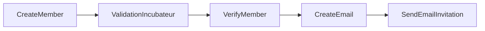
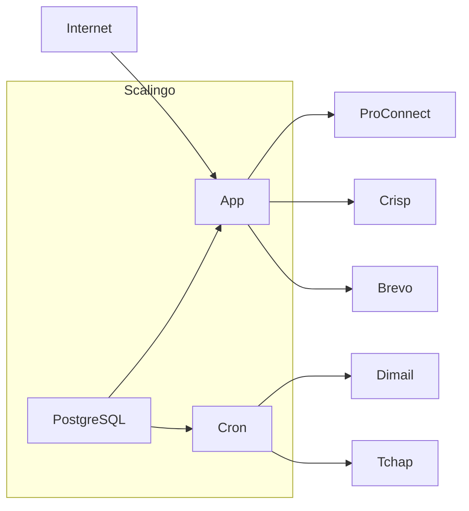

# Espace Membre

L'espace membre de l’incubateur

## Fonctionnalités

- gestion des membres et missions
- gestion des produits, incubateurs, équipes, sponsors
- gestion du compte beta:
  - adresse email & préférences de communication
  - accès aux outils (sentry, matomo)
- exploration de la communauté
- afficher les formations et évènements
- connexion via ProConnect ou magic-link
- tâches de maintenance (cf [Cron Jobs](#cron-jobs)) : emails,
  mattermost, brevo, github

## API v1

La documentation interactive est publique sur
[`/api/docs`](https://espace-membre.incubateur.net/api/docs), et le document
OpenAPI 3.1 qui l'alimente sur
[`/api/v1/openapi.json`](https://espace-membre.incubateur.net/api/v1/openapi.json).

Les appels s'authentifient par clef d'API, avec un en-tête
`Authorization: Bearer em1_<...>`. Une clef se crée depuis l'Espace Membre :
onglet « Clefs d'API » de sa fiche membre pour une clef personnelle, page
`/incubators/{uuid}/api-keys` pour une clef d'application. Le jeton n'est affiché
qu'une seule fois, à la création.

Chaque clef porte des portées (`members:read`, `startups:read`,
`incubators:read`, `startups:write`, `incubators:write`) et deux périmètres
indépendants, un en lecture et un en écriture. Aucune portée n'en implique une
autre : une écriture répond `204` sans corps si la clef ne porte pas la lecture
correspondante.

Le périmètre de lecture s'applique aussi aux sous-ressources : sur
`/api/v1/incubators/{id}/members`, une clef de périmètre `startup/S` atteint bien
les incubateurs de `S`, mais n'y énumère que les membres de `S`. Le chemin ouvre
l'incubateur, il n'élargit pas le périmètre.

Le fonctionnement détaillé, portées, périmètres, cycle de vie et dépannage, est
dans [`docs/api-keys.md`](./docs/api-keys.md).

Une clef sans date d'expiration reçoit deux rappels par courriel, à 90 puis à
180 jours. Ces deux paliers se comptent depuis la dernière confirmation quand il
y en a eu une, sinon depuis la création : confirmer qu'une clef sert toujours
redonne donc réellement deux paliers. La confirmation ne prolonge rien d'autre,
et ne repousse pas la révocation automatique pour inactivité, qui se compte sur
un usage réel.

## Dev de l'app Espace Membre

Un fichier [`Makefile`](./Makefile) ainsi que la partie `scripts` du
fichier [`package.json`](./package.json) recensent les commandes
utiles du projet.

### Variables d'environnement

copier [`.env.development`](./.env.development) en `.env`

### Lancer en mode développement

Un environnement Docker Compose permet de lancer l'application et ses
dépendances ensemble :

```sh
docker compose up
```

Si vous voulez lancer l'application en local, vous devez lui fournir
une base de données accessible via une variable d'environnement `DATABASE_URL`.

### Données initiales

Une fois que votre application tourne, vous pouvez utiliser la
commande suivante pour obtenir des données initiales ; utilisez
d'abord `make sh` pour accéder à votre conteneur Docker.

```sh
npm run seed
npm run dev-import-from-www # Ajoute les données du site beta.gouv.fr (utilisateur, produits, incubateurs, ...)
```

L'application est disponible sur http://localhost:8100 et vous pouvez
vous logger – une fois que la base de données est peuplée avec le
seeding au dessus – avec `valid.member@betagouv.ovh` puis en
récupérant l'email de connexion sur le maildev disponible sur
http://localhost:1080.

### Lancer les tests

```sh
npm run test
```

### Debug avec le serveur SMTP Maildev

[Maildev](http://maildev.github.io/maildev/) est un serveur SMTP avec une interface web conçu pour le développement et les tests.

Le docker-compose intègre une instance de maildev pour le développement.

Tous les emails envoyés par le code de l'espace membre seront visibles depuis l'interface web de Maildev (`http://localhost:1080/`).

## Cron Jobs

> ⚠️ Le Scalingo Scheduler exécute les commandes en UTC (pas de gestion de fuseau
> horaire), contrairement à l'ancienne planification pg-boss qui forçait
> `Europe/Paris`. Les heures ci-dessous sont donc correctes en hiver
> (UTC = heure de Paris − 1h) et décalées d'une heure en été (heure d'été, UTC+2).
> Ces jobs ne s'exécutent que sur l'app dédiée `espace-membre-cron` (garde
> `[[ "$APP" = "espace-membre-cron" ]]`), planifiée via [`cron.json`](./cron.json)
> (Scalingo Scheduler).

> ⚠️ **Scalingo plafonne le nombre d'entrées de `cron.json` à cinq.** Une sixième
> fait échouer le déploiement, avec un `400 Bad Request → You exceeded the max
> amount of cron tasks possible (max is 5)`. Le fichier est à ce plafond : pour
> ajouter un job, il faut soit l'enchaîner dans une entrée existante, comme le
> couple de 8h ci-dessous, soit demander un relèvement au support Scalingo.

Enchaîner deux commandes dans une seule entrée n'est pas qu'un contournement du
plafond : quand l'ordre compte, c'est plus sûr que deux entrées rapprochées. Les
clefs d'API doivent résoudre les destinataires de leurs rappels **avant** que
`clean-teams-members` ne vide `users_teams` des membres expirés, sinon les
rappels partent à un ensemble vide. Deux entrées à des heures voisines ne rendent
cet ordre que probable, une exécution longue pouvant les croiser ; le
chaînage l'impose. Le séparateur est `;` et non `&&`, les deux jobs étant
indépendants : l'échec du premier ne doit pas empêcher le second.

| fréquence (UTC)    | commande                                    | description                                                              |
| ------------------ | ------------------------------------------- | ------------------------------------------------------------------------ |
| `0 18 * * MON-FRI` | `npm run export-to-www`                     | Exporte les données vers le site beta.gouv.fr                            |
| `0 3 * * *`        | `npm run job:sync-matrix-accounts`          | Indexe les comptes Matrix (Tchap) des utilisateurs                       |
| `0 8 * * *`        | `npm run job:api-keys-maintenance` **puis** `npm run job:clean-teams-members` | Révoque les clefs d'API inactives, orphelines ou bloquées et envoie leurs rappels, **puis** supprime les membres expirés des équipes incubateurs |
| `0 8-18 * * *`     | `npm run job:sync-dinum-emails`             | Met à jour la table `dinum_emails` depuis l'API Dimail                   |
| `0 * * * *`        | `npm run job:recreate-email-if-user-active` | Recrée/réactive l'email des comptes actifs repassés en `EMAIL_SUSPENDED` |

Un seul job reste géré par [pg-boss](https://github.com/timgit/pg-boss), déclenché
à la demande (et non planifié) : `create-dimail-mailbox`, qui crée une boite mail
Dimail pour un utilisateur.

Les autres tâches de maintenance (relances avant/après mission, retrait des comptes GitHub/Matomo/Sentry...) sont gérées par des workflows n8n.

## Cycle de vie des utilisateurs

Un utilisateur est représenté par une ou plusieurs **missions** (contrats), chacune
avec une date de début et de fin. L'utilisateur est considéré **actif** tant qu'il a
au moins une mission dont la date de fin n'est pas dépassée
(cf `checkUserIsExpired` dans [`src/lib/utils.ts`](./src/lib/utils.ts)) ; il devient
**expiré** dès que sa dernière mission connue est terminée.

### Arrivée (onboarding)


```mermaid
graph LR

CreateMember-->ValidationIncubateur
ValidationIncubateur-->VerifyMember
VerifyMember-->CreateEmail
CreateEmail-->SendEmailInvitation
```

1. Une fiche membre est créée (par la personne elle-même ou un membre de son
   équipe/produit), avec une première mission.
2. L'incubateur valide la fiche (`ValidationIncubateur`).
3. Le membre vérifie/complète ses informations (`VerifyMember`).
4. Une adresse `@beta.gouv.fr` est créée via Dimail (`CreateEmail`, statut
   `EMAIL_CREATION_WAITING` puis `EMAIL_ACTIVE`).
5. Une invitation est envoyée par email (`SendEmailInvitation`).

### Départ (offboarding)

Déclenché automatiquement à l'approche puis au passage de la date de fin de mission
(workflows n8n) :

- **J-30 / J-15 / J-1** : messages de rappel envoyés au membre (N8N)
- **J+1** : le compte GitHub est retiré de l'organisation (N8N)
- **J+5** : l'email primaire passe en `EMAIL_SUSPENDED` (N8N)
- **J+30** : message final (N8N)
- **J+30** : le compte Tchap est retiré de la communauté (N8N)
- **J+30** : le compte Matomo est désactivé (N8N)
- **J+30** : le compte Sentry est désactivé (N8N)

### Retour d'un utilisateur (self-healing)

Si un utilisateur redevient actif (nouvelle mission) après être passé en
`EMAIL_SUSPENDED`, le job horaire `job:recreate-email-if-user-active`
(voir [Cron Jobs](#cron-jobs)) le détecte et :

- réactive sa boite Dimail existante (repasse `imap_active` à `yes` et le statut à
  `EMAIL_ACTIVE`) si elle existe déjà,
- sinon en crée une nouvelle via `createDimailMailboxForUser`.

### Statuts de l'email primaire (`EmailStatusCode`)

Définis dans [`src/models/member.ts`](./src/models/member.ts) :

| Statut                                              | Signification                        |
| --------------------------------------------------- | ------------------------------------ |
| `EMAIL_UNSET`                                       | Aucun email primaire défini          |
| `EMAIL_CREATION_WAITING` / `EMAIL_CREATION_PENDING` | Création de la boite en cours        |
| `EMAIL_ACTIVE`                                      | Boite active                         |
| `EMAIL_ACTIVE_AND_PASSWORD_DEFINITION_PENDING`      | Boite active, mot de passe à définir |
| `EMAIL_SUSPENDED`                                   | Boite suspendue (mission terminée)   |
| `EMAIL_DELETED`                                     | Boite supprimée _(déprécié)_         |

## Droits

Les permissions sont vérifiées côté serveur (routes sous
[`src/app/api`](./src/app/api)), pas seulement côté affichage :

- **Admin** : liste de logins définie par la variable d'environnement
  `ESPACE_MEMBRE_ADMIN` (cf [`src/server/config/admin.config.ts`](./src/server/config/admin.config.ts)).
  `session.user.isAdmin` est calculé à la connexion et donne tous les droits.
- **Membre d'équipe/produit (Teams)** : peut modifier la fiche d'un autre membre
  s'il appartient à une équipe incubateur en commun avec ce membre (via ses
  produits ou ses équipes), ou s'il partage un produit avec lui et a un statut
  légal `contractuel` ou `fonctionnaire`. Logique implémentée dans
  [`src/lib/authorization/member.ts`](./src/lib/authorization/member.ts) (fonction `canEditMember`).
- **Member** : peut modifier son propre compte. L'édition d'une fiche produit est
  conditionnée à l'appartenance à une équipe d'un des incubateurs liés au produit,
  ou au statut d'agent public actif sur ce produit. Il ne peut pas modifier la
  fiche d'un autre membre en dehors du cas ci-dessus.
- **Anonymous** : aucun accès aux pages privées (redirection vers `/login`).

### Matrice des droits

Le rôle ne suffit pas à décrire les droits : un membre ordinaire en tire du
**rattachement au produit**, par son équipe d'incubateur ou par sa mission. Les
deux dernières lignes ne sont donc pas des rôles mais des situations, qui
s'ajoutent à « Member ».

| Situation | Inviter un membre | Modifier mon compte | Modifier un membre | Éditer une fiche produit | Clef perso. lecture | Clef perso. écriture | Clef d'application |
| --- | :---: | :---: | :---: | :---: | :---: | :---: | :---: |
| Admin | ✅ | ✅ | ✅ | ✅ | ✅ | ✅ global inclus | ✅ |
| Équipe d'un incubateur lié | ✅ | ✅ | ✅ | ✅ | ✅ | ✅ incubateur et ses produits | ✅ son incubateur, si vivant |
| Agent public en mission sur le produit | ✅ | ✅ | ✅ un membre du même produit | ✅ ce produit | ✅ | ✅ ce produit seulement | ❌ |
| Member sans rattachement | ✅ | ✅ | ❌ | ❌ | ✅ | ❌ | ❌ |
| Anonymous | ❌ | ❌ | ❌ | ❌ | ❌ | ❌ | ❌ |

Trois précisions qui évitent les mauvaises surprises.

**La lecture est libre.** N'importe quel membre peut créer une clef de périmètre
global en lecture, c'est une décision assumée : l'espace membre n'a pas de donnée
dont la lecture soit réservée entre membres. La liste de périmètres proposée au
formulaire ne décrit donc pas un droit, seulement les rattachements vivants de la
personne, pour l'aider à se restreindre.

**« Agent public en mission »** veut dire trois conditions cumulées : une mission
commencée et non terminée sur ce produit, une mission sans date de fin comptant
comme ouverte donc vivante, et un `legal_status` valant `fonctionnaire` ou
`contractuel`. Un membre sans statut déclaré, cas de tout compte jamais vérifié,
ne remplit jamais cette ligne.

**L'écriture sur un incubateur passe uniquement par l'équipe**, jamais par une
mission, et un périmètre de clef de nature produit ne l'ouvre pas non plus : la
portée `incubators:write` exige un périmètre global ou incubateur. Créer une clef
d'application demande en plus de porter une mission non expirée : siéger dans
l'équipe ne suffit pas si toutes les missions sont terminées.

Toutes les décisions d'accès vivent dans
[`src/lib/authorization/`](./src/lib/authorization/) : les prédicats `can*`
décident quoi afficher, les gardes `assertCan*` jettent une `AuthorizationError`
et sont appelées par les server actions.

Trois variables d'environnement pilotent les clefs d'API, à côté de
`ESPACE_MEMBRE_ADMIN` : `API_KEYS_CREATION_DISABLED` (bloque la création),
`API_KEYS_AUTH_DISABLED` (coupe-circuit d'incident, répond 503 sur toute
l'API v1) et `API_KEYS_BLOCKED_USERS` (liste d'usernames dont les clefs
personnelles sont refusées, relue à chaque requête).

## Diagramme de flux


```mermaid
graph LR

Internet-->App

subgraph Scalingo
PostgreSQL-->App
PostgreSQL-->Cron
end

App-->ProConnect
App-->Crisp
App-->Brevo

Cron-->Dimail
Cron-->Tchap
```
