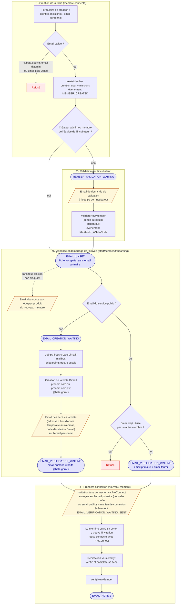
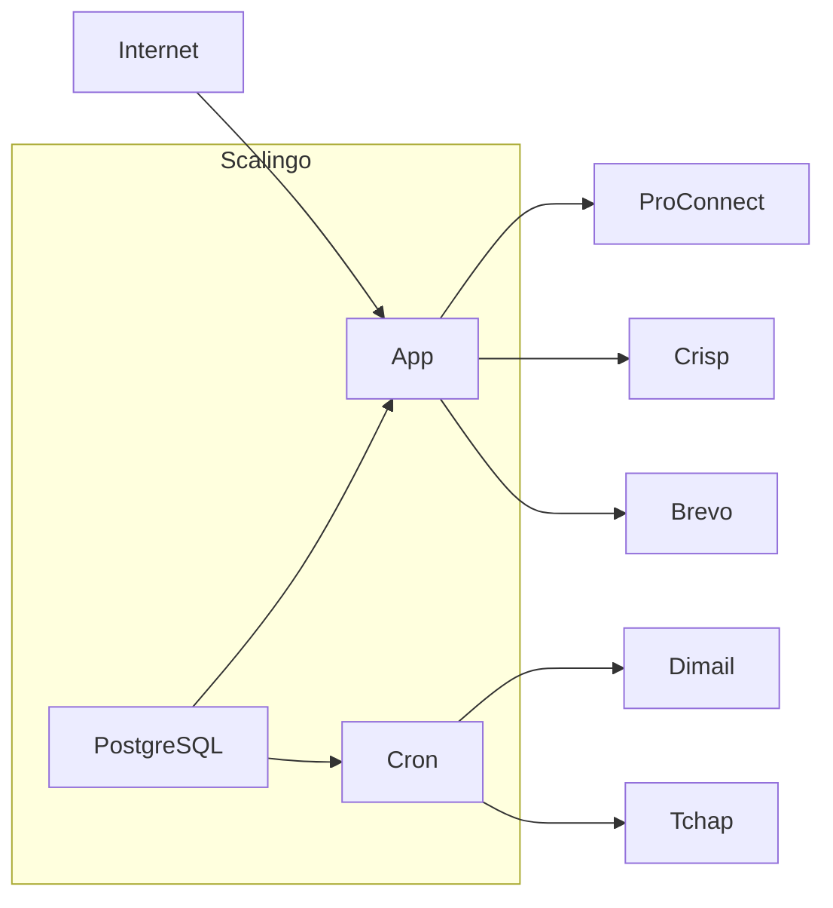

# Espace Membre

L'espace membre de l’incubateur

## Fonctionnalités

- gestion des membres et missions
- gestion des produits, incubateurs, équipes, sponsors
- gestion du compte beta:
  - adresse email & préférences de communication
  - accès aux outils (sentry, matomo)
- exploration de la communauté
- afficher les formations et évènements
- connexion uniquement via ProConnect, avec l'adresse principale du membre
  (boîte `@beta.gouv.fr` ou adresse du service public). L'email personnel
  (`secondary_email`) ne permet pas de se connecter. La double authentification
  est exigée (claim `acr` essentiel, niveaux `eidas0-mfa`, `eidas1-mfa`,
  `eidas2`, `eidas3`, vérifié dans l'`id_token` au retour). Aide : page
  publique `/support`
- tâches de maintenance (cf [Cron Jobs](#cron-jobs)) : emails,
  mattermost, brevo, github

## API en lecture

La doc OPENAPI est dispo sur `/api/protected/openapi.json`.

Vous pouvez y accéder avec un header `X-Api-Key` à demander à l'équipe animation

## Dev de l'app Espace Membre

Un fichier [`Makefile`](./Makefile) ainsi que la partie `scripts` du
fichier [`package.json`](./package.json) recensent les commandes
utiles du projet.

### Variables d'environnement

copier [`.env.development`](./.env.development) en `.env`

`ESPACE_MEMBRE_ADMIN` liste les administrateurs de l'espace membre, sous forme
de `username` (`prenom.nom`) séparés par des virgules.

Les items de checklist marqués `restricted: true` dans
[`onboarding.yml`](./src/lib/checklists/onboarding.yml), par exemple la
participation à l'atelier d'embarquement, ne sont pas auto-déclaratifs : seuls
les administrateurs et les membres de l'équipe d'animation de la DINUM peuvent
les cocher. Cette équipe est identifiée par son `ghid`
`dinum-animation-beta-gouv-fr` dans la table `teams` — plusieurs incubateurs ont
une équipe nommée « Animation », le `ghid` est ce qui les distingue. Il n'y a
pas de variable d'environnement : l'appartenance est lue en base.

### Lancer en mode développement

Un environnement Docker Compose permet de lancer l'application et ses
dépendances ensemble :

```sh
docker compose up
```

Si vous voulez lancer l'application en local, vous devez lui fournir
une base de données accessible via une variable d'environnement `DATABASE_URL`.

### Données initiales

Une fois que votre application tourne, vous pouvez utiliser la
commande suivante pour obtenir des données initiales ; utilisez
d'abord `make sh` pour accéder à votre conteneur Docker.

```sh
npm run seed
npm run dev-import-from-www # Ajoute les données du site beta.gouv.fr (utilisateur, produits, incubateurs, ...)
```

L'application est disponible sur http://localhost:8100. Les emails envoyés par
l'application sont visibles sur le maildev http://localhost:1080.

En développement (`next dev`), l'environnement d'intégration ProConnect n'est
pas utilisable : la page `/login` propose une **connexion ProConnect simulée**.
On y saisit l'adresse principale d'un membre présent en base (pas son email
personnel) et on est connecté sans mot de passe, avec les mêmes règles que la
vraie connexion (un seul membre correspondant, mission en cours, fiche validée
et adresse de connexion prête). Ce mode
n'existe que quand `NODE_ENV=development` : il est absent de toute application
buildée (production, staging, review apps). `FAKE_PROCONNECT_LOGIN=false` le
désactive en local, par exemple pour tester le vrai ProConnect avec les
variables `PRO_CONNECT_*`.

### Lancer les tests

```sh
npm run test
```

### Debug avec le serveur SMTP Maildev

[Maildev](http://maildev.github.io/maildev/) est un serveur SMTP avec une interface web conçu pour le développement et les tests.

Le docker-compose intègre une instance de maildev pour le développement.

Tous les emails envoyés par le code de l'espace membre seront visibles depuis l'interface web de Maildev (`http://localhost:1080/`).

## Cron Jobs

> ⚠️ Le Scalingo Scheduler exécute les commandes en UTC (pas de gestion de fuseau
> horaire), contrairement à l'ancienne planification pg-boss qui forçait
> `Europe/Paris`. Les heures ci-dessous sont donc correctes en hiver
> (UTC = heure de Paris − 1h) et décalées d'une heure en été (heure d'été, UTC+2).
> Ces jobs ne s'exécutent que sur l'app dédiée `espace-membre-cron` (garde
> `[[ "$APP" = "espace-membre-cron" ]]`), planifiée via [`cron.json`](./cron.json)
> (Scalingo Scheduler).

| fréquence (UTC)    | commande                                    | description                                                              |
| ------------------ | ------------------------------------------- | ------------------------------------------------------------------------ |
| `0 18 * * MON-FRI` | `npm run export-to-www`                     | Exporte les données vers le site beta.gouv.fr                            |
| `0 3 * * *`        | `npm run job:sync-matrix-accounts`          | Indexe les comptes Matrix (Tchap) des utilisateurs                       |
| `0 8 * * *`        | `npm run job:clean-teams-members`           | Supprime les membres expirés des équipes incubateurs                     |
| `0 8-18 * * *`     | `npm run job:sync-dinum-emails`             | Met à jour la table `dinum_emails` depuis l'API Dimail                   |
| `0 * * * *`        | `npm run job:recreate-email-if-user-active` | Recrée/réactive l'email des comptes actifs repassés en `EMAIL_SUSPENDED` |

Un seul job reste géré par [pg-boss](https://github.com/timgit/pg-boss), déclenché
à la demande (et non planifié) : `create-dimail-mailbox`, qui crée une boite mail
Dimail pour un utilisateur. Il est déclenché à l'arrivée d'un membre (validation
de la fiche, ou création par une personne autorisée) avec `onboarding: true` :
une fois la boite créée, et après 10 secondes d'attente (le temps que la boite
accepte le courrier, réglable via `DIMAIL_INVITATION_DELAY_MS`), il envoie sur
cette boite l'invitation à se connecter via ProConnect.
En cas de relance (retry), la boite n'est pas recréée et l'invitation n'est
envoyée qu'une fois.

Les autres tâches de maintenance (relances avant/après mission, retrait des comptes GitHub/Matomo/Sentry...) sont gérées par des workflows n8n.

## Cycle de vie des utilisateurs

Un utilisateur est représenté par une ou plusieurs **missions** (contrats), chacune
avec une date de début et de fin. L'utilisateur est considéré **actif** tant qu'il a
au moins une mission dont la date de fin n'est pas dépassée
(cf `checkUserIsExpired` dans [`src/lib/utils.ts`](./src/lib/utils.ts)) ; il devient
**expiré** dès que sa dernière mission connue est terminée.

### Arrivée (onboarding)


```mermaid
flowchart TD
    classDef status fill:#e3e3fd,stroke:#000091,color:#000091
    classDef mail fill:#fef7da,stroke:#b34000,color:#3a3a3a
    classDef ko fill:#ffe9e9,stroke:#ce0500,color:#ce0500

    subgraph creation["1 - Création de la fiche (membre connecté)"]
        A["Formulaire de création :<br/>identité, mission(s), email personnel"] --> B{"Email valide ?"}
        B -- "@beta.gouv.fr, email d'admin<br/>ou email déjà utilisé" --> KO["Refusé"]:::ko
        B -- oui --> C["createMember :<br/>création user + missions<br/>événement MEMBER_CREATED"]
        C --> D{"Créateur admin ou membre<br/>de l'équipe de l'incubateur ?"}
    end

    subgraph validation["2 - Validation par l'incubateur"]
        S1(["MEMBER_VALIDATION_WAITING"]):::status
        S1 --> M1[/"Email de demande de validation<br/>à l'équipe de l'incubateur"/]:::mail
        M1 --> E["validateNewMember<br/>(admin ou équipe incubateur)<br/>événement MEMBER_VALIDATED"]
    end

    subgraph onboarding["3 - Annonce et démarrage de l'arrivée (startMemberOnboarding)"]
        S2(["EMAIL_UNSET<br/>fiche acceptée, sans email primaire"]):::status
        S2 -. "dans tous les cas,<br/>non bloquant" .-> M2[/"Email d'annonce aux équipes produit<br/>du nouveau membre"/]:::mail
        S2 --> F{"Email du service public ?"}
        F -- non --> S3(["EMAIL_CREATION_WAITING"]):::status
        S3 --> G["Job pg-boss create-dimail-mailbox<br/>onboarding: true, 5 essais"]
        G --> H["Création de la boîte Dimail<br/>prenom.nom ou prenom.nom.ext<br/>@beta.gouv.fr"]
        H --> M3[/"Email des accès à la boîte<br/>(adresse + lien d'accès temporaire au webmail,<br/>code d'invitation Dimail)<br/>sur l'email personnel"/]:::mail
        M3 --> S4(["EMAIL_VERIFICATION_WAITING<br/>email primaire = boîte @beta.gouv.fr"]):::status
        F -- oui --> I{"Email déjà utilisé<br/>par un autre membre ?"}
        I -- oui --> KO2["Refusé"]:::ko
        I -- non --> S5(["EMAIL_VERIFICATION_WAITING<br/>email primaire = email fourni"]):::status
    end

    subgraph connexion["4 - Première connexion (nouveau membre)"]
        M4[/"Invitation à se connecter via ProConnect<br/>envoyée sur l'email primaire (nouvelle boîte<br/>ou email public), sans lien de connexion<br/>événement EMAIL_VERIFICATION_WAITING_SENT"/]:::mail
        M4 --> J["Le membre ouvre sa boîte, y trouve l'invitation<br/>et se connecte avec ProConnect"]
        J --> K["Redirection vers /verify :<br/>vérifie et complète sa fiche"]
        K --> L["verifyNewMember"]
        L --> S6(["EMAIL_ACTIVE"]):::status
    end

    D -- non --> S1
    D -- oui --> S2
    E --> S2
    S4 --> M4
    S5 --> M4
```

Les nœuds arrondis sont les valeurs de `primary_email_status`, les
parallélogrammes les emails envoyés.

1. Une fiche membre est créée par un membre de la communauté, avec une
   première mission et l'email personnel du nouveau membre (une adresse
   `@beta.gouv.fr` ou un email déjà utilisé sont refusés).
2. L'incubateur valide la fiche (statut `MEMBER_VALIDATION_WAITING`). Cette
   étape est sautée si la personne qui crée la fiche est admin ou membre de
   l'équipe de l'incubateur.
3. La fiche acceptée passe en `EMAIL_UNSET` (pas encore d'adresse de
   connexion) et l'arrivée démarre (`startMemberOnboarding`). Dans tous les cas (fiche
   validée par l'incubateur ou validée d'office à la création), un email
   annonce ensuite l'arrivée aux membres actifs des produits du nouveau
   membre ; un échec de cette annonce ne bloque pas l'arrivée. Si l'arrivée n'a
   pas pu démarrer (ex : file de jobs indisponible), rouvrir
   `/community/<username>/validate` la relance.
   - email personnel : une adresse `@beta.gouv.fr` est créée
     via Dimail (statut `EMAIL_CREATION_WAITING`). Le nom est
     `prenom.nom` pour les agents publics (`legal_status`, ou à défaut statut
     `admin` de la dernière mission), `prenom.nom.ext` sinon. Les
     attributaires (domaine « Attributaire » ou type de membre
     « attributaire ») ont toujours une adresse en `.ext`. Un lien
     d'accès temporaire au webmail (code d'invitation Dimail, sans mot de
     passe) est envoyé sur l'email personnel ;
   - email du service public : cet email devient l'adresse principale, pas de
     nouvelle boite.

   Seul l'email compte : les attributaires suivent le même parcours que les
   autres membres externes (boîte `@beta.gouv.fr` si leur email n'est pas celui
   d'un service public).
4. Une fois l'adresse principale prête (statut `EMAIL_VERIFICATION_WAITING`), une
   invitation à se connecter **via ProConnect** est envoyée **sur cette adresse
   principale** (sans lien de connexion) : le membre la trouve en ouvrant sa
   nouvelle boîte pour la première fois. L'email personnel ne reçoit que le
   lien d'accès à la boîte.
5. Le membre se connecte avec ProConnect, puis vérifie/complète ses informations
   (page `/verify`, statut `EMAIL_ACTIVE`).

### Départ (offboarding)

Déclenché automatiquement à l'approche puis au passage de la date de fin de mission
(workflows n8n) :

Voir https://github.com/betagouv/n8n-workflows

### Retour d'un utilisateur (self-healing)

Si un utilisateur redevient actif (nouvelle mission) après être passé en
`EMAIL_SUSPENDED`, le job horaire `job:recreate-email-if-user-active`
(voir [Cron Jobs](#cron-jobs)) le détecte et :

- réactive sa boite Dimail existante (repasse `imap_active` à `yes` et le statut à
  `EMAIL_ACTIVE`) si elle existe déjà,
- sinon en crée une nouvelle via `createDimailMailboxForUser`.

### Statuts de l'email primaire (`EmailStatusCode`)

Définis dans [`src/models/member.ts`](./src/models/member.ts) :

| Statut                                              | Signification                        |
| --------------------------------------------------- | ------------------------------------ |
| `EMAIL_UNSET`                                       | Aucun email primaire défini ; statut d'une fiche acceptée dont l'arrivée démarre |
| `MEMBER_VALIDATION_WAITING`                         | Fiche en attente de validation par l'incubateur |
| `EMAIL_VERIFICATION_WAITING`                        | Adresse de connexion prête, invitation envoyée : le membre doit se connecter et vérifier sa fiche |
| `EMAIL_CREATION_WAITING` / `EMAIL_CREATION_PENDING` | Création de la boite en cours        |
| `EMAIL_ACTIVE`                                      | Boite active                         |
| `EMAIL_ACTIVE_AND_PASSWORD_DEFINITION_PENDING`      | Boite active, mot de passe à définir |
| `EMAIL_SUSPENDED`                                   | Boite suspendue (mission terminée)   |
| `EMAIL_DELETED`                                     | Boite supprimée _(déprécié)_         |

## Droits

Les permissions sont vérifiées côté serveur (routes sous
[`src/app/api`](./src/app/api)), pas seulement côté affichage :

- **Admin** : liste de logins définie par la variable d'environnement
  `ESPACE_MEMBRE_ADMIN` (cf [`src/server/config/admin.config.ts`](./src/server/config/admin.config.ts)).
  `session.user.isAdmin` est calculé à la connexion et donne tous les droits.
- **Membre d'équipe/produit (Teams)** : peut modifier la fiche d'un autre membre
  s'il appartient à une équipe incubateur en commun avec ce membre (via ses
  produits ou ses équipes), ou s'il partage un produit avec lui et a un statut
  légal `contractuel` ou `fonctionnaire`. Logique implémentée dans
  [`src/lib/canEditMember.ts`](./src/lib/canEditMember.ts) (fonction `canEditMember`).
- **Member** : peut modifier son propre compte et éditer les fiches produit, mais
  pas la fiche d'un autre membre en dehors du cas ci-dessus.
- **Anonymous** : aucun accès aux pages privées (redirection vers `/login`).

### Matrice des droits

| Rôle      | Inviter un membre | Modifier mon compte | Modifier un membre | Editer une fiche produit |
| --------- | :---------------: | :-----------------: | :----------------: | :----------------------: |
| Admin     |        ✅         |         ✅          |         ✅         |            ✅            |
| Teams     |        ✅         |         ✅          |         ✅         |            ✅            |
| Member    |        ✅         |         ✅          |         ❌         |            ✅            |
| Anonymous |        ❌         |         ❌          |         ❌         |            ❌            |

## Diagramme de flux


```mermaid
graph LR

Internet-->App

subgraph Scalingo
PostgreSQL-->App
PostgreSQL-->Cron
end

App-->ProConnect
App-->Crisp
App-->Brevo

Cron-->Dimail
Cron-->Tchap
```
