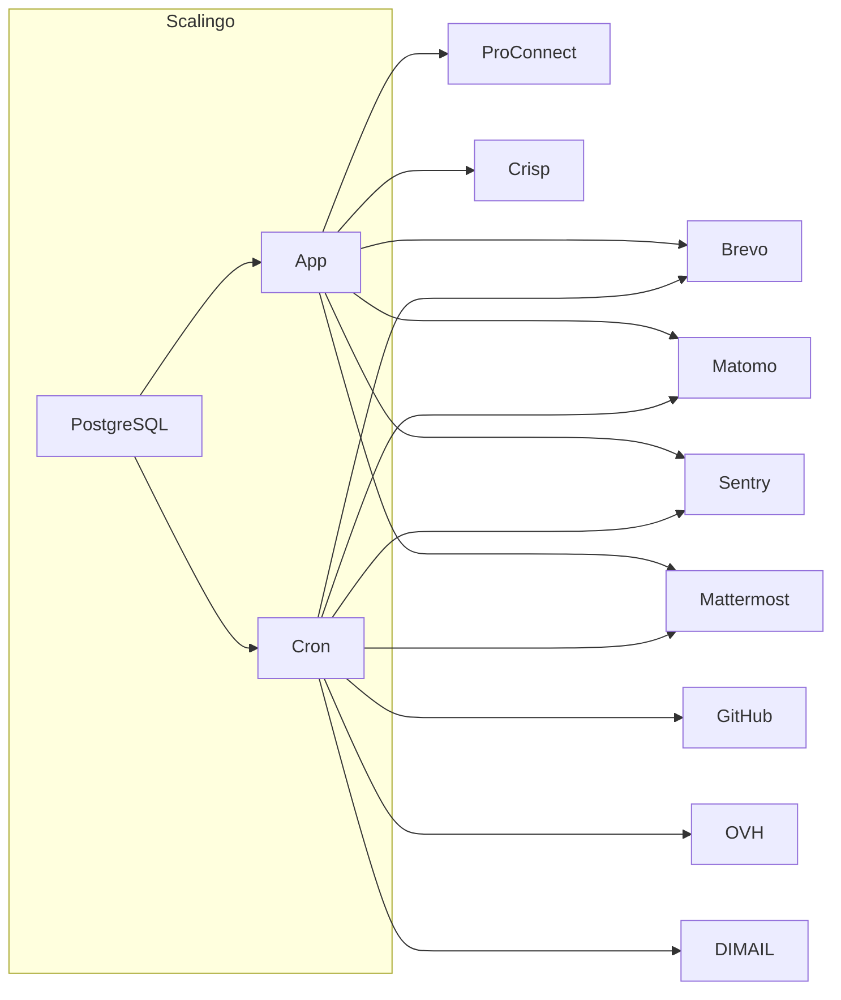

# Espace Membre

L'espace membre de l’incubateur

## Fonctionnalités

- gestion des membres et missions
- gestion des produits, incubateurs, équipes, sponsors
- gestion du compte beta:
  - adresse email & préférences de communication
  - accès aux outils (sentry, matomo)
- exploration de la communauté
- afficher les formations et évènements
- gestion de l'infolettre
- connexion via ProConnect ou magic-link
- tâches de maintenance (cf [CRON.md](./CRON.md)) : emails,
  mattermost, brevo, github

## Dev de l'app Espace Membre

Un fichier [`Makefile`](./Makefile) ainsi que la partie `scripts` du
fichier [`package.json`](./package.json) recensent les commandes
utiles du projet.

### Variables d'environnement

copier [`.env.development`](./.env.development) en `.env`

### Lancer en mode développement

Un environnement Docker Compose permet de lancer l'application et ses
dépendances ensemble :

```sh
docker compose up
```

Si vous voulez lancer l'application en local, vous devez lui fournir
une base de données accessible via une variable d'environnement `DATABASE_URL`.

### Données initiales

Une fois que votre application tourne, vous pouvez utiliser la
commande suivante pour obtenir des données initiales ; utilisez
d'abord `make sh` pour accéder à votre conteneur Docker.

```sh
npm run seed
npm run dev-import-from-www # Ajoute les données du site beta.gouv.fr (utilisateur, produits, incubateurs, ...)
```

L'application est disponible sur http://localhost:8100 et vous pouvez
vous logger – une fois que la base de données est peuplée avec le
seeding au dessus – avec `valid.member@betagouv.ovh` puis en
récupérant l'email de connexion sur le maildev disponible sur
http://localhost:1080.

### Lancer les tests

```sh
npm run test
```

### Debug avec le serveur SMTP Maildev

[Maildev](http://maildev.github.io/maildev/) est un serveur SMTP avec une interface web conçu pour le développement et les tests.

Le docker-compose intègre une instance de maildev pour le développement.

Tous les emails envoyés par le code de l'espace membre seront visibles depuis l'interface web de Maildev (`http://localhost:1080/`).

### Générer clé API OVH

_Si vous n'avez pas les droits pour générer les credentials OVH, postez un message sur [#incubateur-amélioration-secretariat](https://startups-detat.slack.com/archives/C017J6CUN2V)._

Lien : https://eu.api.ovh.com/createToken/

- Nécessaires pour les fonctionalités en cours

```
GET /email/domain/beta.gouv.fr/*
POST /email/domain/beta.gouv.fr/account
DELETE /email/domain/beta.gouv.fr/account/*
POST /email/domain/beta.gouv.fr/redirection
DELETE /email/domain/beta.gouv.fr/redirection/*
POST /email/domain/beta.gouv.fr/account/*/changePassword
```

- Nécessaires pour les prochaines fonctionalités

```
POST /email/domain/beta.gouv.fr/mailingList
POST /email/domain/beta.gouv.fr/mailingList/*/subscriber
DELETE /email/domain/beta.gouv.fr/mailingList/*/subscriber/*
GET /email/domain/beta.gouv.fr/mailingList/*/subscriber
GET /email/domain/beta.gouv.fr/responder/*
POST /email/domain/beta.gouv.fr/responder
PUT /email/domain/beta.gouv.fr/responder/*
DELETE /email/domain/beta.gouv.fr/responder/*
```

### Debug sans notifications Mattermost

Pour certaines actions, l'espace membre envoie une notification Mattermost. En local, vous pouvez mettre les variables d'environnements `CHAT_WEBHOOK_URL_SECRETARIAT` et `CHAT_WEBHOOK_URL_GENERAL` à un service qui reçoit des requêtes POST et répond avec un `200 OK` systématiquement.

[Beeceptor](https://beeceptor.com/) permet de le faire avec une interface en ligne sans besoin de télécharger quoi que ce soit.

Sinon, certains outils gratuits comme [Mockoon](https://mockoon.com/) ou [Postman](https://www.postman.com/) permettent de créer des serveurs mock facilement aussi ([Guide Postman](https://learning.postman.com/docs/designing-and-developing-your-api/mocking-data/setting-up-mock/#creating-mock-servers-in-app)).

### Debug avec un autre domaine OVH

Lorsqu'on utilise un autre domaine OVH (par exemple, un domain bac-à-sable pour le développement), la variable `SECRETARIAT_DOMAIN` doit être renseignée. Par défaut, le domaine est `beta.gouv.fr`.

## Scripts pour faire des taches en local

### Générer le graphe des redirections emails

- Configurer les variables d'environnements : `OVH_APP_KEY`, `OVH_APP_SECRET` et `OVH_CONSUMER_KEY` (Avec une clé ayant un accès aux emails)
- Lancer le script : `node ./scripts/export_redirections_to_dot.ts > redirections.dot`
- Lancer graphviz : `dot -Tpdf redirections.dot -o redirections.pdf` (Format disponible : svg,png, ...)

### Supprimer une redirection

- Configurer les variables d'environnements : `OVH_APP_KEY`, `OVH_APP_SECRET` et `OVH_CONSUMER_KEY` (Avec une clé ayant un accès aux emails)
- Lancer le script : `node ./scripts/delete_redirections.js from@beta.gouv.fr to@example.com`

## Cron Jobs

Voir le détail dans [CRON.md](./CRON.md)

## Emails

Voir le détail dans [EMAIL.md](./EMAIL.md)

## Storybook

Nous utilisons **Storybook** principalement pour documenter l’apparence des emails, et potentiellement d'autres composants à l’avenir. Afin de garder la base de code principale propre et bien organisée, Storybook est configuré comme un **sous-module Git** dans un dépôt séparé :

👉 [https://github.com/betagouv/espace-membre-storybook](https://github.com/betagouv/espace-membre-storybook)

### Instructions d’installation

Pour initialiser et utiliser le sous-module Storybook :

```bash
git submodule init
git submodule update
cd storybook
npm install
```

Une fois dans le dossier `storybook`, vous pouvez exécuter les commandes suivantes, définies dans son `package.json` :

- `npm run storybook` : Lance l’application Storybook — elle devrait s’ouvrir automatiquement dans votre navigateur.
- `npm run chromatic` : Si vous avez un token Chromatic (voir ci-dessous), cette commande construit et envoie votre Storybook à Chromatic.
- `npm run build-storybook` : Génère la version statique de Storybook.

### Chromatic

Pour activer Chromatic, créez un fichier `.env` dans le dossier `storybook` et ajoutez-y la variable d’environnement suivante :

```bash
CHROMATIC_PROJECT_TOKEN=your_token_here
```

Vous pouvez obtenir un token gratuitement en créant un projet sur [chromatic.com](https://www.chromatic.com).

## Workflows

### Member creation


### Member Offboarding

- J-30 : [Message J-30](https://github.com/betagouv/espace-membre-next/blob/main/src/server/views/templates/emails/DepartureReminderInXDaysEmail/DepartureReminderInXDaysEmail.tsx#L28)
- J-15 : [Message J-15](https://github.com/betagouv/espace-membre-next/blob/main/src/server/views/templates/emails/DepartureReminderInXDaysEmail/DepartureReminderInXDaysEmail.tsx#L28)
- J-1 : [Message J-1](https://github.com/betagouv/espace-membre-next/blob/main/src/server/views/templates/emails/DepartureReminderInXDaysEmail/DepartureReminderInXDaysEmail.tsx#L28)
- J+1 : [Message J+1](https://github.com/betagouv/espace-membre-next/blob/45dafdfd7fe522f0f64c90486896e305ab34de3b/src/server/views/templates/emails/NoMoreContractEmail/NoMoreContractXDaysEmail.tsx#L26)
- J+1 : GitHub account is removed from organisation
- J+5 : email is set as SUSPENDED [⚠ BROKEN]
- J+30 : [Message J+30](https://github.com/betagouv/espace-membre-next/blob/45dafdfd7fe522f0f64c90486896e305ab34de3b/src/server/views/templates/emails/NoMoreContractEmail/NoMoreContractXDaysEmail.tsx#L26)
- J+30 : mattermost account is removed from community and added to alumni [⚠ BROKEN]
- J+30 : matomo account is disabled
- J+30 : sentry account is disabled

see [CRON.md](./CRON.md)

### Matrice des droits

| Rôle      | Inviter un membre | Modifier mon compte | Modifier un membre | Editer une fiche produit |
| --------- | :---------------: | :-----------------: | :----------------: | :----------------------: |
| Admin     |        ✅         |         ✅          |         ✅         |            ✅            |
| Teams     |        ✅         |         ✅          |         ✅         |            ✅            |
| Member    |        ✅         |         ✅          |         ❌         |            ✅            |
| Anonymous |        ❌         |         ❌          |         ❌         |            ❌            |

### Diagramme de flux




