## Diagram

```mermaid
erDiagram

    events {
        id uuid PK "not null"
        action_on_startup uuid FK "null"
        action_code text "not null"
        created_by_username text "not null"
        created_at timestamp_with_time_zone "not null"
        action_metadata hstore "null"
        action_on_username text "null"
    }

    formations {
        id uuid PK "not null"
        name text "not null"
        created_at timestamp_with_time_zone "not null"
        formation_date timestamp_with_time_zone "not null"
        is_embarquement boolean "null"
        airtable_id character_varying "null"
        formation_type character_varying "null"
        formation_type_airtable_id character_varying "null"
    }

    incubators {
        uuid uuid PK "not null"
        owner_id uuid FK "null"
        title character_varying "not null"
        address character_varying "null"
        contact character_varying "null"
        ghid character_varying "null"
        description text "null"
        github text "null"
        short_description text "null"
        website text "null"
        highlighted_startups uuid[] "null"
    }

    mattermost_member_infos {
        last_activity_at date "null"
        mattermost_user_id text "null"
        username text "null"
    }

    missions {
        uuid uuid PK "not null"
        user_id uuid FK "null"
        start date "not null"
        id integer "not null"
        employer character_varying "null"
        end date "null"
        status missions_status_enum "null"
    }

    missions_startups {
        uuid uuid PK "not null"
        mission_id uuid FK "not null"
        startup_id uuid FK "not null"
        mission_id uuid "not null"
        startup_id uuid "not null"
    }

    newsletters {
        id uuid PK "not null"
        url text "not null"
        created_at timestamp_with_time_zone "not null"
        year_week character_varying "null"
        brevo_url text "null"
        validator text "null"
        publish_at timestamp_with_time_zone "null"
        sent_at timestamp_with_time_zone "null"
    }

    organizations {
        uuid uuid PK "not null"
        domaine_ministeriel character_varying "not null"
        name character_varying "not null"
        type character_varying "not null"
        acronym character_varying "null"
        ghid character_varying "null"
    }

    phases {
        uuid uuid PK "not null"
        startup_id uuid FK "not null"
        name startups_phase_enum "not null"
        start timestamp_with_time_zone "not null"
        startup_id uuid "not null"
        comment text "null"
        end timestamp_with_time_zone "null"
    }

    service_accounts {
        uuid uuid PK "not null"
        user_id uuid FK "null"
        account_type character_varying "not null"
        created_at timestamp_with_time_zone "not null"
        updated_at timestamp_with_time_zone "not null"
        email character_varying "null"
        service_user_id character_varying "null"
        status character_varying "null"
        metadata jsonb "null"
    }

    startup_events {
        uuid uuid PK "not null"
        startup_id uuid FK "null"
        name character_varying "not null"
        date date "not null"
        comment text "null"
    }

    startups {
        uuid uuid PK "not null"
        incubator_id uuid FK "null"
        ghid character_varying "not null"
        name character_varying "not null"
        created_at timestamp_with_time_zone "not null"
        updated_at timestamp_with_time_zone "not null"
        analyse_risques boolean "null"
        has_mobile_app boolean "null"
        is_private_url boolean "null"
        mon_service_securise boolean "null"
        stats boolean "null"
        accessibility_status character_varying "null"
        mailing_list character_varying "null"
        techno jsonb "null"
        thematiques jsonb "null"
        usertypes jsonb "null"
        analyse_risques_url text "null"
        budget_url text "null"
        contact text "null"
        dashlord_url text "null"
        description text "null"
        link text "null"
        pitch text "null"
        repository text "null"
        stats_url text "null"
    }

    startups_files {
        uuid text PK "not null"
        startup_id uuid FK "not null"
        created_at timestamp_with_time_zone "not null"
        created_by uuid "not null"
        base64 bytea "null"
        size integer "null"
        data jsonb "null"
        comments text "null"
        filename text "null"
        title text "null"
        type text "null"
        deleted_at timestamp_with_time_zone "null"
        deleted_by uuid "null"
    }

    startups_organizations {
        uuid uuid PK "not null"
        organization_id uuid FK "not null"
        startup_id uuid FK "not null"
        organization_id uuid "not null"
        startup_id uuid "not null"
    }

    teams {
        uuid uuid PK "not null"
        incubator_id uuid FK "not null"
        name character_varying "not null"
        created_at timestamp_with_time_zone "not null"
        updated_at timestamp_with_time_zone "not null"
        ghid character_varying "null"
        mission text "null"
    }

    users {
        username text PK "not null"
        fullname character_varying "not null"
        role character_varying "not null"
        created_at timestamp_with_time_zone "not null"
        updated_at timestamp_with_time_zone "not null"
        domaine users_domaine_enum "not null"
        uuid uuid "not null"
        email_is_redirection boolean "null"
        communication_email character_varying "null"
        github character_varying "null"
        legal_status character_varying "null"
        member_type character_varying "null"
        primary_email_status character_varying "null"
        tjm integer "null"
        competences jsonb "null"
        average_nb_of_days real "null"
        avatar text "null"
        bio text "null"
        gender text "null"
        link text "null"
        osm_city text "null"
        primary_email text "null"
        secondary_email text "null"
        workplace_insee_code text "null"
        email_verified timestamp_with_time_zone "null"
        primary_email_status_updated_at timestamp_with_time_zone "null"
    }

    users_formations {
        username text FK "null"
        formation_id uuid FK "null"
    }

    users_teams {
        uuid uuid PK "not null"
        team_id uuid FK "not null"
        user_id uuid FK "not null"
        team_id uuid "not null"
        user_id uuid "not null"
    }

    formations ||--o{ users_formations : "users_formations(formation_id) -> formations(id)"
    incubators ||--o{ startups : "startups(incubator_id) -> incubators(uuid)"
    incubators ||--o{ teams : "teams(incubator_id) -> incubators(uuid)"
    missions ||--o{ missions_startups : "missions_startups(mission_id) -> missions(uuid)"
    organizations ||--o{ incubators : "incubators(owner_id) -> organizations(uuid)"
    organizations ||--o{ startups_organizations : "startups_organizations(organization_id) -> organizations(uuid)"
    startups ||--o{ events : "events(action_on_startup) -> startups(uuid)"
    startups ||--o{ missions_startups : "missions_startups(startup_id) -> startups(uuid)"
    startups ||--o{ phases : "phases(startup_id) -> startups(uuid)"
    startups ||--o{ startup_events : "startup_events(startup_id) -> startups(uuid)"
    startups ||--o{ startups_files : "startups_files(startup_id) -> startups(uuid)"
    startups ||--o{ startups_organizations : "startups_organizations(startup_id) -> startups(uuid)"
    teams ||--o{ users_teams : "users_teams(team_id) -> teams(uuid)"
    users ||--o{ missions : "missions(user_id) -> users(uuid)"
    users ||--o{ service_accounts : "service_accounts(user_id) -> users(uuid)"
    users ||--o{ users_formations : "users_formations(username) -> users(username)"
    users ||--o{ users_teams : "users_teams(user_id) -> users(uuid)"
```

## Indexes

### `events`

-   `events_pkey`

### `formations`

-   `formations_airtable_id_unique`
-   `formations_pkey`

### `incubators`

-   `incubators_ghid_unique`
-   `incubators_pkey`

### `missions`

-   `missions_pkey`

### `missions_startups`

-   `missions_startups_pkey`
-   `missions_startups_startup_id_mission_id_unique`

### `newsletters`

-   `newsletters_pkey`

### `organizations`

-   `organizations_acronym_unique`
-   `organizations_ghid_unique`
-   `organizations_name_unique`
-   `organizations_pkey`

### `phases`

-   `phases_pkey`
-   `phases_startup_id_name_unique`

### `service_accounts`

-   `service_accounts_account_type_service_user_id_email_unique`
-   `service_accounts_pkey`

### `startup_events`

-   `startup_events_pkey`

### `startups`

-   `startups_id_unique`
-   `startups_pkey`

### `startups_files`

-   `startups_files_pkey`

### `startups_organizations`

-   `startups_organizations_pkey`
-   `startups_organizations_startup_id_organization_id_unique`

### `teams`

-   `teams_ghid_unique`
-   `teams_pkey`

### `users`

-   `users_pkey`
-   `users_uuid_unique`

### `users_formations`

-   `users_formations_formation_id_index`
-   `users_formations_username_index`

### `users_teams`

-   `users_teams_pkey`
-   `users_teams_user_id_team_id_unique`
