## Diagram

```mermaid
erDiagram

    accounts {
        id integer PK "not null"
        provider character_varying "not null"
        providerAccountId character_varying "not null"
        type character_varying "not null"
        userId character_varying "not null"
        expires_at bigint "null"
        access_token text "null"
        id_token text "null"
        refresh_token text "null"
        scope text "null"
        session_state text "null"
        token_type text "null"
    }

    dinum_emails {
        uuid uuid PK "not null"
        email character_varying "not null"
        created_at timestamp_with_time_zone "not null"
        updated_at timestamp_with_time_zone "not null"
        destination character_varying "null"
        status character_varying "null"
        type character_varying "null"
    }

    events {
        id uuid PK "not null"
        action_on_startup uuid FK "null"
        action_code text "not null"
        created_by_username text "not null"
        created_at timestamp_with_time_zone "not null"
        action_metadata hstore "null"
        action_on_username text "null"
    }

    formations {
        id uuid PK "not null"
        name text "not null"
        created_at timestamp_with_time_zone "not null"
        formation_date timestamp_with_time_zone "not null"
        is_embarquement boolean "null"
        airtable_id character_varying "null"
        formation_type character_varying "null"
        formation_type_airtable_id character_varying "null"
    }

    incubators {
        uuid uuid PK "not null"
        owner_id uuid FK "null"
        title character_varying "not null"
        address character_varying "null"
        contact character_varying "null"
        ghid character_varying "null"
        description text "null"
        github text "null"
        short_description text "null"
        website text "null"
        highlighted_startups uuid[] "null"
    }

    marrainage {
        username text PK "not null"
        completed boolean "not null"
        count integer "not null"
        last_onboarder text "not null"
        created_at timestamp_with_time_zone "not null"
        last_updated timestamp_with_time_zone "not null"
    }

    marrainage_groups {
        id integer PK "not null"
        count integer "not null"
        onboarder character_varying "null"
        status character_varying "null"
        created_at timestamp_with_time_zone "null"
    }

    marrainage_groups_members {
        marrainage_group_id bigint PK "not null"
        username character_varying PK "not null"
        marrainage_group_id bigint FK "not null"
        username character_varying FK "not null"
    }

    matomo_sites {
        id uuid PK "not null"
        startup_id uuid FK "null"
        name character_varying "not null"
        type character_varying "not null"
        matomo_id integer "not null"
        created_at timestamp_with_time_zone "not null"
        updated_at timestamp_with_time_zone "not null"
        url text "null"
    }

    mattermost_member_infos {
        last_activity_at date "null"
        mattermost_user_id text "null"
        username text "null"
    }

    missions {
        uuid uuid PK "not null"
        user_id uuid FK "null"
        start date "not null"
        id integer "not null"
        employer character_varying "null"
        end date "null"
        status missions_status_enum "null"
    }

    missions_startups {
        uuid uuid PK "not null"
        mission_id uuid FK "not null"
        startup_id uuid FK "not null"
        mission_id uuid "not null"
        startup_id uuid "not null"
    }

    newsletters {
        id uuid PK "not null"
        url text "not null"
        created_at timestamp_with_time_zone "not null"
        year_week character_varying "null"
        brevo_url text "null"
        validator text "null"
        publish_at timestamp_with_time_zone "null"
        sent_at timestamp_with_time_zone "null"
    }

    organizations {
        uuid uuid PK "not null"
        domaine_ministeriel character_varying "not null"
        name character_varying "not null"
        type character_varying "not null"
        acronym character_varying "null"
        ghid character_varying "null"
    }

    phases {
        uuid uuid PK "not null"
        startup_id uuid FK "not null"
        name startups_phase_enum "not null"
        start timestamp_with_time_zone "not null"
        startup_id uuid "not null"
        comment text "null"
        end timestamp_with_time_zone "null"
    }

    sentry_teams {
        id uuid PK "not null"
        startup_id uuid FK "null"
        name character_varying "not null"
        sentry_id character_varying "not null"
        created_at timestamp_with_time_zone "not null"
        updated_at timestamp_with_time_zone "not null"
        slug character_varying "null"
    }

    service_accounts {
        uuid uuid PK "not null"
        user_id uuid FK "null"
        account_type character_varying "not null"
        created_at timestamp_with_time_zone "not null"
        updated_at timestamp_with_time_zone "not null"
        email character_varying "null"
        service_user_id character_varying "null"
        status character_varying "null"
        metadata jsonb "null"
    }

    sessions {
        id integer PK "not null"
        sessionToken character_varying "not null"
        userId character_varying "not null"
        expires timestamp_with_time_zone "not null"
    }

    startup_events {
        uuid uuid PK "not null"
        startup_id uuid FK "null"
        name character_varying "not null"
        date date "not null"
        comment text "null"
    }

    startups {
        uuid uuid PK "not null"
        incubator_id uuid FK "null"
        ghid character_varying "not null"
        name character_varying "not null"
        created_at timestamp_with_time_zone "not null"
        updated_at timestamp_with_time_zone "not null"
        analyse_risques boolean "null"
        has_mobile_app boolean "null"
        is_private_url boolean "null"
        mon_service_securise boolean "null"
        stats boolean "null"
        accessibility_status character_varying "null"
        dsfr_status character_varying "null"
        ecodesign_url character_varying "null"
        impact_url character_varying "null"
        mailing_list character_varying "null"
        roadmap_url character_varying "null"
        tech_audit_url character_varying "null"
        techno jsonb "null"
        thematiques jsonb "null"
        usertypes jsonb "null"
        analyse_risques_url text "null"
        budget_url text "null"
        contact text "null"
        dashlord_url text "null"
        description text "null"
        link text "null"
        pitch text "null"
        repository text "null"
        stats_url text "null"
    }

    startups_files {
        uuid text PK "not null"
        startup_id uuid FK "not null"
        created_at timestamp_with_time_zone "not null"
        created_by uuid "not null"
        base64 bytea "null"
        size integer "null"
        data jsonb "null"
        comments text "null"
        filename text "null"
        title text "null"
        type text "null"
        deleted_at timestamp_with_time_zone "null"
        deleted_by uuid "null"
    }

    startups_organizations {
        uuid uuid PK "not null"
        organization_id uuid FK "not null"
        startup_id uuid FK "not null"
        organization_id uuid "not null"
        startup_id uuid "not null"
    }

    tasks {
        name text PK "not null"
        created_at timestamp_with_time_zone "not null"
        updated_at timestamp_with_time_zone "not null"
        description text "null"
        error_message text "null"
        last_completed timestamp_with_time_zone "null"
        last_failed timestamp_with_time_zone "null"
    }

    teams {
        uuid uuid PK "not null"
        incubator_id uuid FK "not null"
        name character_varying "not null"
        created_at timestamp_with_time_zone "not null"
        updated_at timestamp_with_time_zone "not null"
        ghid character_varying "null"
        mission text "null"
    }

    user_events {
        uuid uuid PK "not null"
        user_id uuid FK "not null"
        field_id character_varying "not null"
        created_at timestamp_with_time_zone "not null"
        date timestamp_with_time_zone "not null"
        updated_at timestamp_with_time_zone "not null"
        user_id uuid "not null"
    }

    users {
        username text PK "not null"
        fullname character_varying "not null"
        role character_varying "not null"
        created_at timestamp_with_time_zone "not null"
        updated_at timestamp_with_time_zone "not null"
        domaine users_domaine_enum "not null"
        uuid uuid "not null"
        email_is_redirection boolean "null"
        communication_email character_varying "null"
        github character_varying "null"
        legal_status character_varying "null"
        member_type character_varying "null"
        primary_email_status character_varying "null"
        tjm integer "null"
        competences jsonb "null"
        average_nb_of_days real "null"
        avatar text "null"
        bio text "null"
        gender text "null"
        link text "null"
        osm_city text "null"
        primary_email text "null"
        secondary_email text "null"
        workplace_insee_code text "null"
        email_verified timestamp_with_time_zone "null"
        primary_email_status_updated_at timestamp_with_time_zone "null"
    }

    users_formations {
        username text FK "null"
        formation_id uuid FK "null"
    }

    users_teams {
        uuid uuid PK "not null"
        team_id uuid FK "not null"
        user_id uuid FK "not null"
        team_id uuid "not null"
        user_id uuid "not null"
    }

    verification_tokens {
        identifier text PK "not null"
        token text PK "not null"
        expires timestamp_with_time_zone "not null"
    }

    formations ||--o{ users_formations : "users_formations(formation_id) -> formations(id)"
    incubators ||--o{ startups : "startups(incubator_id) -> incubators(uuid)"
    incubators ||--o{ teams : "teams(incubator_id) -> incubators(uuid)"
    marrainage_groups ||--o{ marrainage_groups_members : "marrainage_groups_members(marrainage_group_id) -> marrainage_groups(id)"
    missions ||--o{ missions_startups : "missions_startups(mission_id) -> missions(uuid)"
    organizations ||--o{ incubators : "incubators(owner_id) -> organizations(uuid)"
    organizations ||--o{ startups_organizations : "startups_organizations(organization_id) -> organizations(uuid)"
    startups ||--o{ events : "events(action_on_startup) -> startups(uuid)"
    startups ||--o{ matomo_sites : "matomo_sites(startup_id) -> startups(uuid)"
    startups ||--o{ missions_startups : "missions_startups(startup_id) -> startups(uuid)"
    startups ||--o{ phases : "phases(startup_id) -> startups(uuid)"
    startups ||--o{ sentry_teams : "sentry_teams(startup_id) -> startups(uuid)"
    startups ||--o{ startup_events : "startup_events(startup_id) -> startups(uuid)"
    startups ||--o{ startups_files : "startups_files(startup_id) -> startups(uuid)"
    startups ||--o{ startups_organizations : "startups_organizations(startup_id) -> startups(uuid)"
    teams ||--o{ users_teams : "users_teams(team_id) -> teams(uuid)"
    users ||--o{ marrainage_groups_members : "marrainage_groups_members(username) -> users(username)"
    users ||--o{ missions : "missions(user_id) -> users(uuid)"
    users ||--o{ service_accounts : "service_accounts(user_id) -> users(uuid)"
    users ||--o{ user_events : "user_events(user_id) -> users(uuid)"
    users ||--o{ users_formations : "users_formations(username) -> users(username)"
    users ||--o{ users_teams : "users_teams(user_id) -> users(uuid)"
```

## Indexes

### `accounts`

- `accounts_pkey`

### `dinum_emails`

- `dinum_emails_email_unique`
- `dinum_emails_pkey`

### `events`

- `events_pkey`

### `formations`

- `formations_airtable_id_unique`
- `formations_pkey`

### `incubators`

- `incubators_ghid_unique`
- `incubators_pkey`

### `marrainage`

- `marrainage_pkey`

### `marrainage_groups`

- `marrainage_groups_pkey`

### `marrainage_groups_members`

- `marrainage_groups_members_marrainage_group_id_index`
- `marrainage_groups_members_pkey`
- `marrainage_groups_members_username_index`

### `matomo_sites`

- `matomo_sites_matomo_id_unique`
- `matomo_sites_pkey`

### `missions`

- `missions_pkey`

### `missions_startups`

- `missions_startups_pkey`
- `missions_startups_startup_id_mission_id_unique`

### `newsletters`

- `newsletters_pkey`

### `organizations`

- `organizations_acronym_unique`
- `organizations_ghid_unique`
- `organizations_name_unique`
- `organizations_pkey`

### `phases`

- `phases_pkey`
- `phases_startup_id_name_unique`

### `sentry_teams`

- `sentry_teams_pkey`
- `sentry_teams_sentry_id_unique`
- `sentry_teams_slug_unique`

### `service_accounts`

- `service_accounts_account_type_service_user_id_email_unique`
- `service_accounts_pkey`

### `sessions`

- `sessions_pkey`

### `startup_events`

- `startup_events_pkey`

### `startups`

- `startups_id_unique`
- `startups_pkey`

### `startups_files`

- `startups_files_pkey`

### `startups_organizations`

- `startups_organizations_pkey`
- `startups_organizations_startup_id_organization_id_unique`

### `tasks`

- `tasks_pkey`

### `teams`

- `teams_ghid_unique`
- `teams_pkey`

### `user_events`

- `user_events_field_id_user_id_unique`
- `user_events_pkey`

### `users`

- `users_pkey`
- `users_uuid_unique`

### `users_formations`

- `users_formations_formation_id_index`
- `users_formations_username_index`

### `users_teams`

- `users_teams_pkey`
- `users_teams_user_id_team_id_unique`

### `verification_tokens`

- `verification_tokens_pkey`
